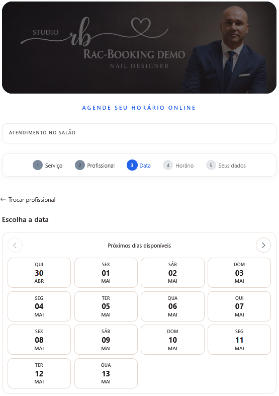

# RAC Booking Demo

This document presents the main flows of RAC Booking through screenshots and technical notes.

## 1. Public Booking Flow

Customers can book appointments online by selecting:

1. Service
2. Professional
3. Date
4. Available time slot
5. Customer information

---

## 2. Availability Engine

The availability engine calculates valid time slots based on:

- Professional working hours
- Existing appointments
- Schedule blocks
- Service duration
- Buffer time between appointments

---

## 3. Admin Calendar

Business owners can manage appointments from an internal calendar view.

---

## 4. Services and Professionals

Administrators can manage services, professionals, and which services each professional can perform.

---

## 5. Architecture Highlights

- .NET 8 backend
- Angular frontend
- PostgreSQL database
- Clean Architecture
- CQRS with MediatR
- Dockerized environment
- Designed to support multi-tenant scenarios

## Booking Flow

### 1. Landing

### 2. Select Service

### 3. Select Professional

### 4. Select Date

### 5. Select Time

### 6. Confirmation

---

## Admin Dashboard

