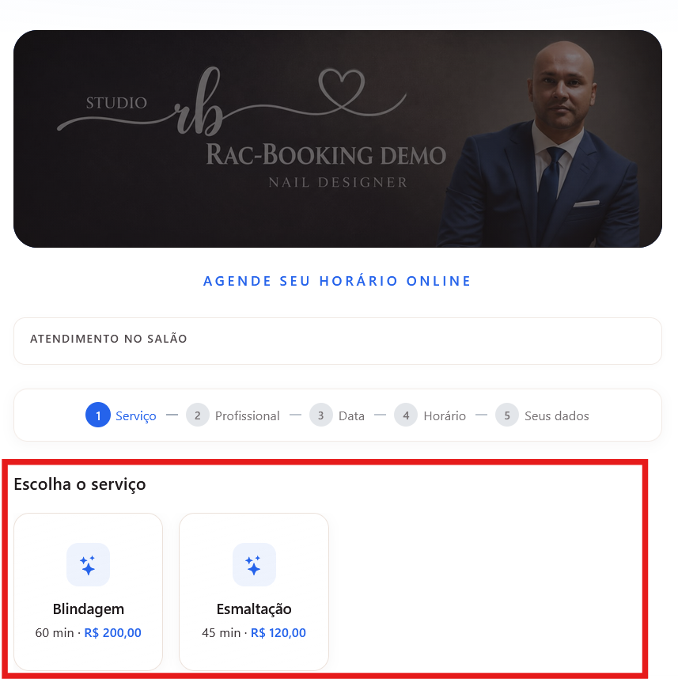
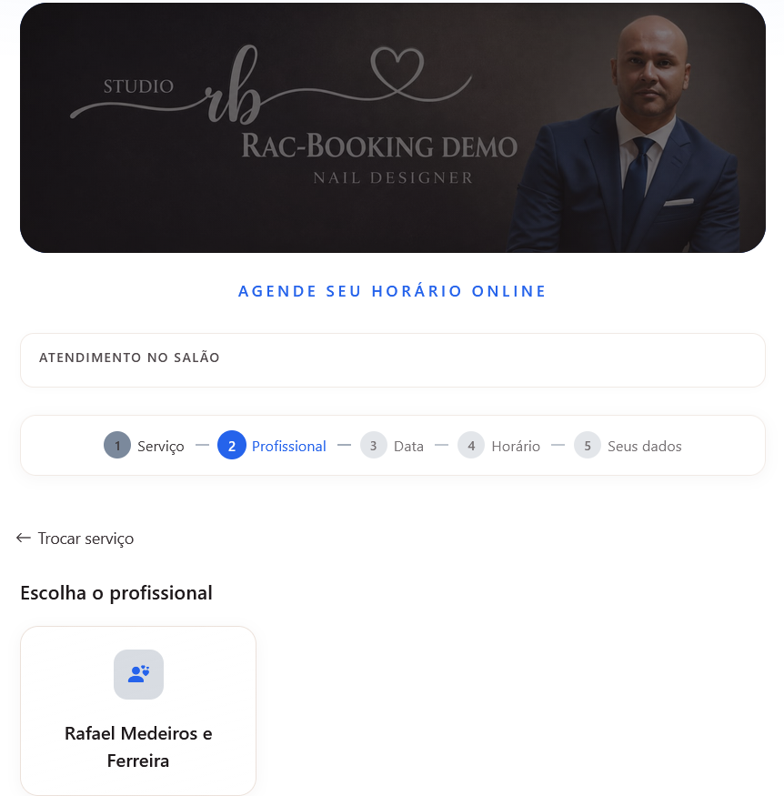
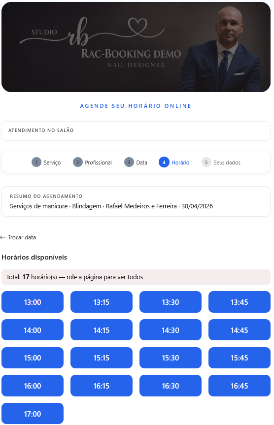
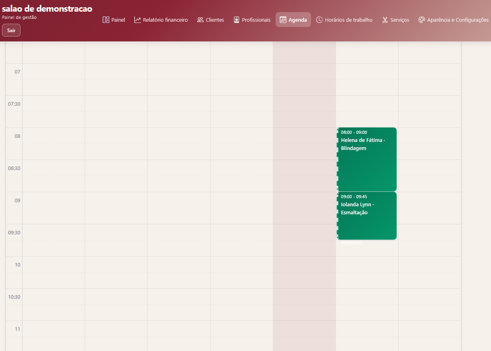

# RAC Booking Demo

This document provides a visual walkthrough of RAC Booking, a multi-tenant SaaS scheduling platform for service-based businesses.

The goal of this demo is to highlight the end-to-end booking experience and the administrative workflow used to manage appointments.

---

## 1. Public Booking Entry

The customer starts on a tenant-branded public booking page.

> ℹ️ **Dynamic Branding**
> 
> The banner image, colors, and overall visual identity are fully configurable per tenant.
> 
> Each salon can customize:
> - primary, secondary, and accent colors
> - logo and header/banner image
> - general visual identity of the booking page
> - allowing the application to reflect each tenant’s brand identity
> The screenshot above shows one example tenant configuration.
---

## 2. Service Selection

The customer selects the desired service.

---

## 3. Professional Selection

The system allows choosing the professional responsible for the service.

---

## 4. Date Selection

Available dates are determined based on professional schedules and business rules.

---

## 5. Time Slot Selection

Available time slots are generated by the availability engine, considering:

- Working hours  
- Existing bookings  
- Service duration  
- Buffer time  

---

## 6. Booking Information

The customer provides required information to complete the booking.

---

## 7. Booking Confirmation

The system validates and confirms the appointment.

---

## 8. Admin Calendar

After booking, appointments are managed through the admin calendar.

---

## Technical Highlights Demonstrated

This demo showcases:

- Multi-step public booking flow  
- Professional-based scheduling  
- Availability engine with conflict prevention  
- Tenant-branded experience  
- Real-world SaaS scheduling behavior  
- Administrative calendar management  

---

## Architecture Context

RAC Booking was built with a production-oriented architecture using:

- .NET 8  
- Clean Architecture  
- CQRS with MediatR  
- Entity Framework Core  
- PostgreSQL  
- Angular  
- Docker  

For more details, see:

- [Architecture](./architecture.md)  
- [Multi-Tenancy](./multi-tenancy.md)  
- [Availability Engine](./availability-engine.md)  
